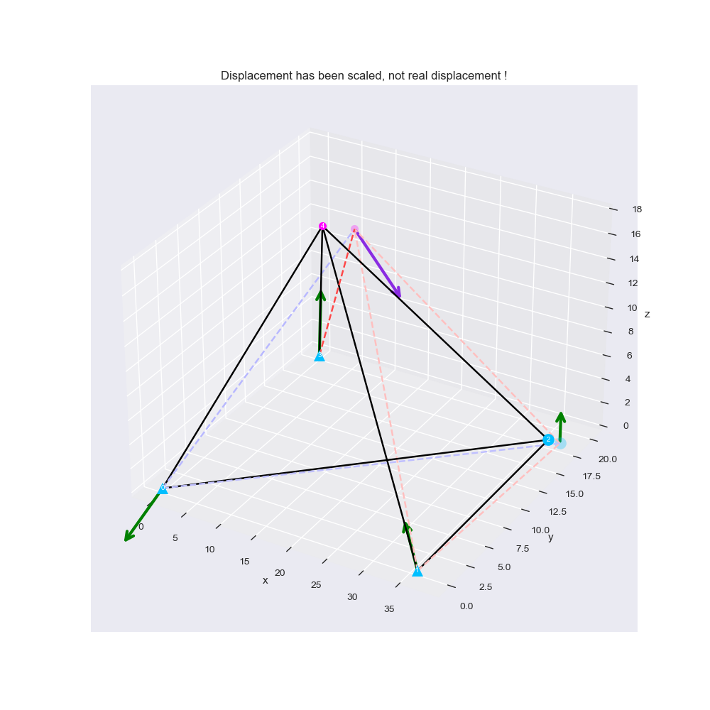
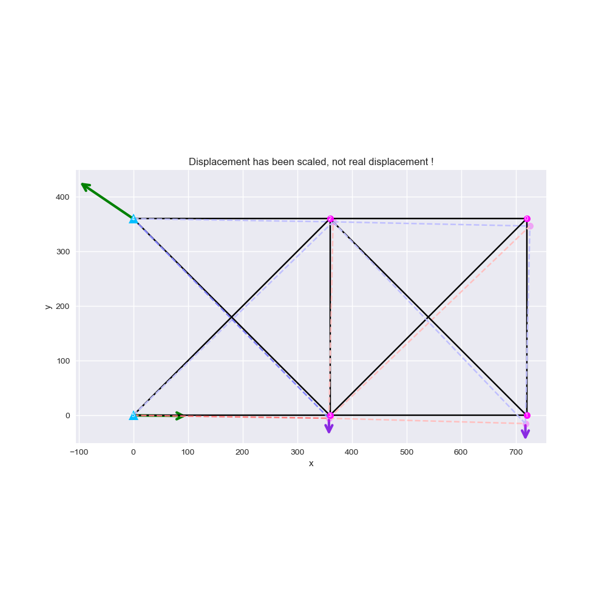
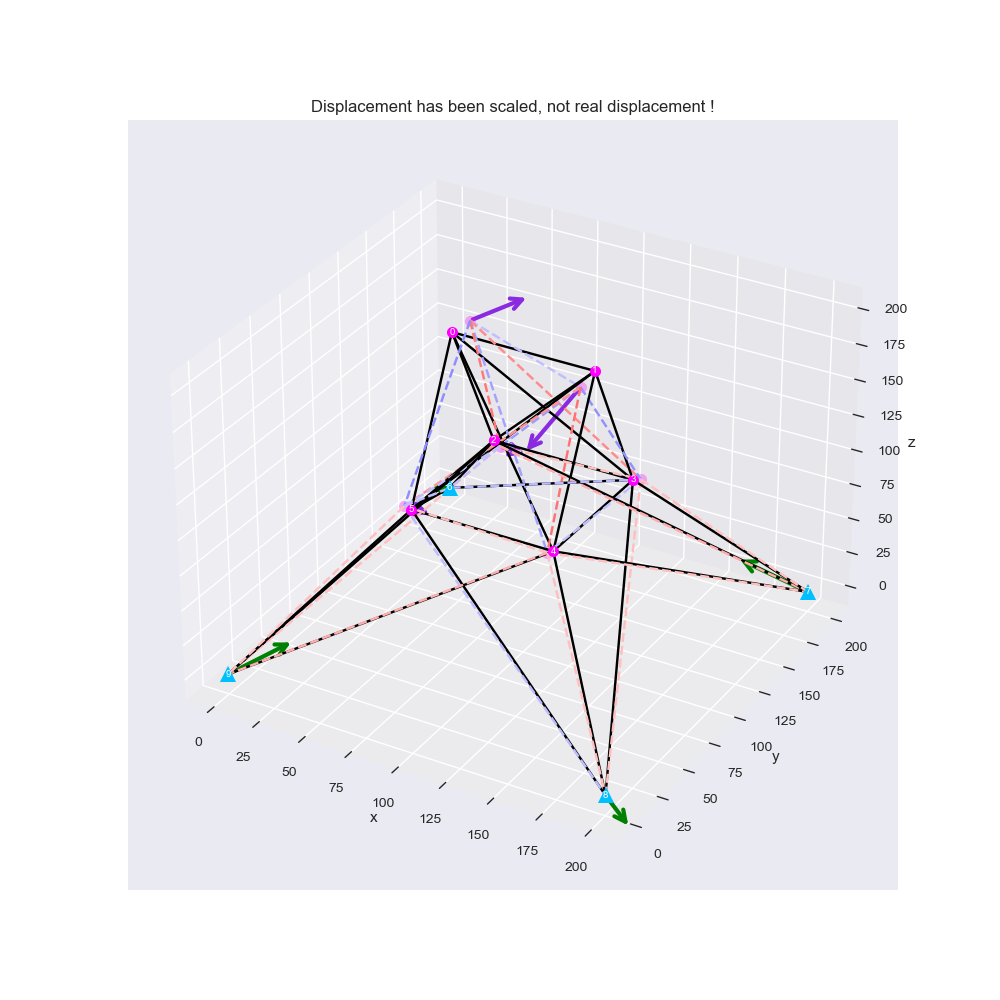
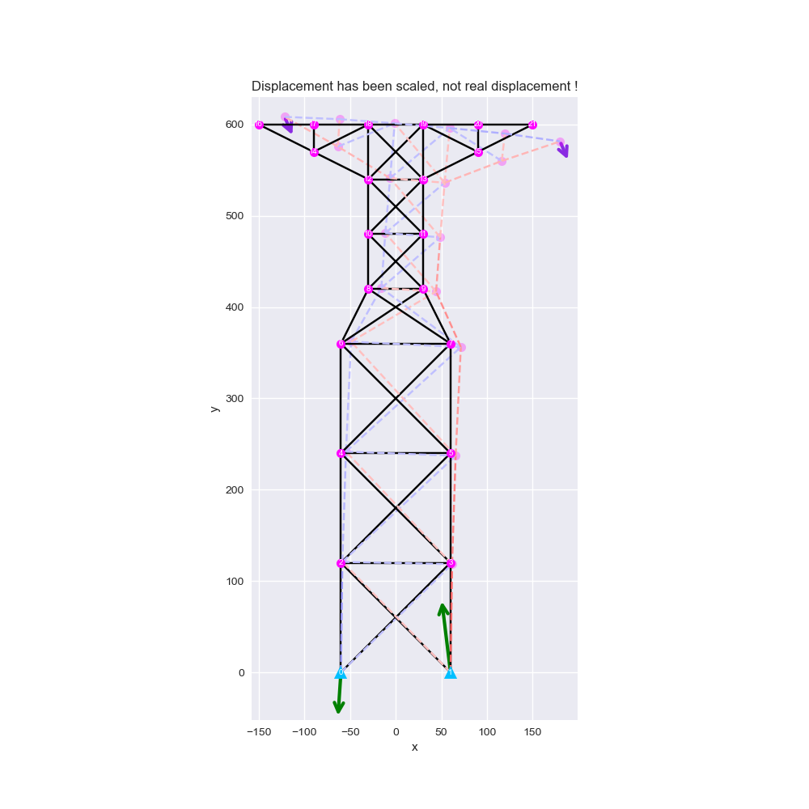
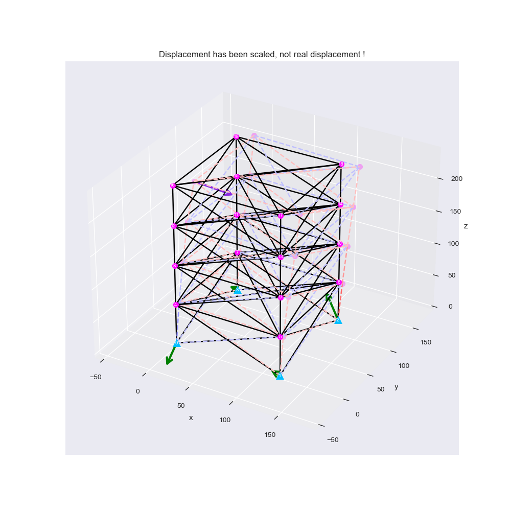
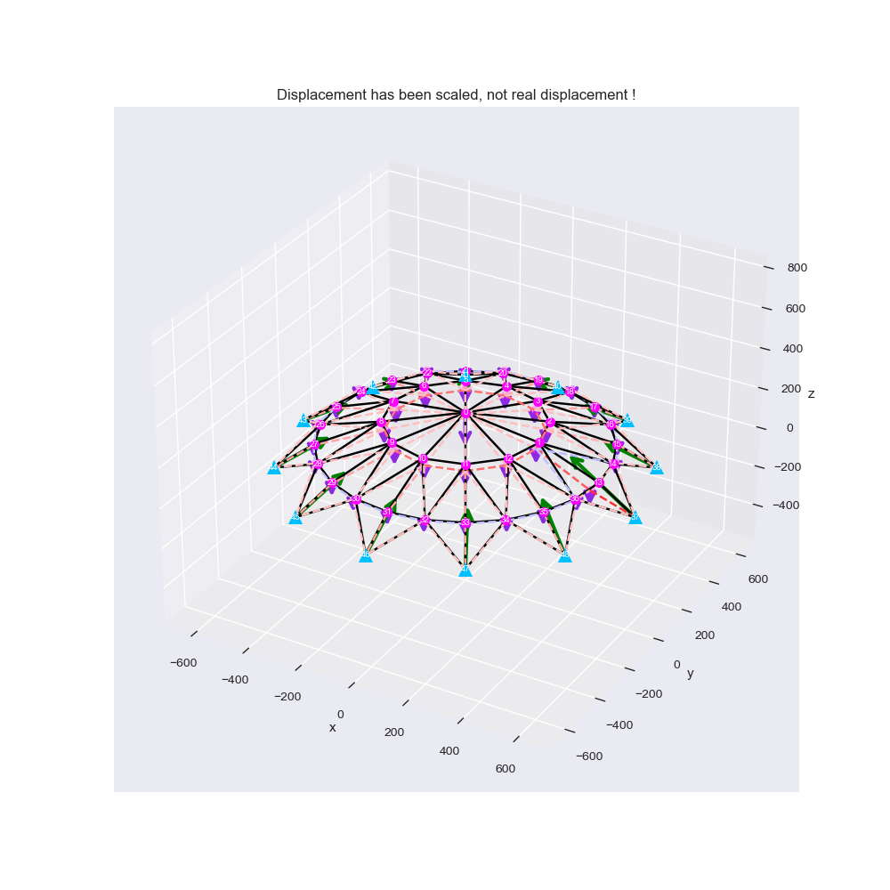
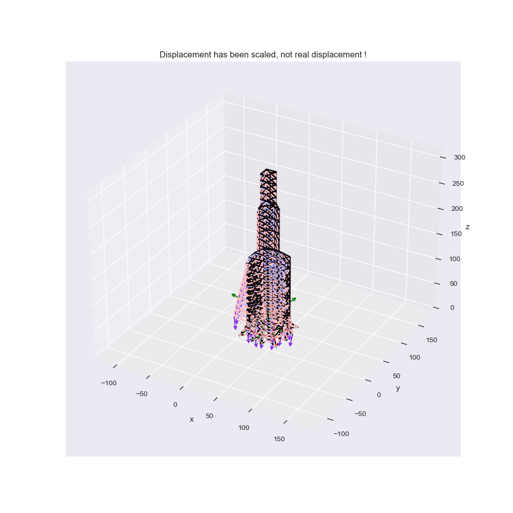

# **slientruss3d** : Python for stable truss analysis and optimization tool

[](https://pypi.org/project/slientruss3d/)
[](https://pypi.org/project/slientruss3d/)
[](https://github.com/leo27945875/Python_Stable_3D_Truss_Analysis/releases)
[](https://pypi.org/project/slientruss3d/)
[](https://github.com/leo27945875/Python_Stable_3D_Truss_Analysis/blob/master/LICENSE.txt)

---

## Desciption

**`slientruss3d`** is a python package which can solve the resistances, internal forces and joint dispalcements in a stable 2D or 3D truss by `direct stiffness method`. And also can do truss optimization by `Genetic Algorithm (GA)` conveniencely.  
  
This repo is writen by  :

```text
Taiwan                                          (臺灣)
Department of Civil Engineering                 (土木工程學系)
National Yang Ming Chiao Tung University (NYCU) (國立陽明交通大學)
Shih-Chi Cheng                                  (鄭適其)
```

## Content

[How to use](##How-to-use-?)


## New feature in v1.2.x update !

After slientruss3d v1.2.x, you could use **`slientruss3d.ga`** module to do `truss type selection optimization` conveniencely with `Genetic Algorithm (GA)`! Just simply define the topology of the truss and what member types you want to use, and then you could start the optimization.  
The following is the example code of GA:

```python
from slientruss3d.truss import Truss
from slientruss3d.type  import MemberType
from slientruss3d.ga    import GA
import random


def TestGA():
    # Allowable stress and displacement:
    ALLOWABLE_STRESS         = 30000.
    ALLOWABLE_DISPLACEMENT   = 10.

    # Type the member types you want to use here:
    MEMBER_TYPE_LIST = [MemberType(inch, random.uniform(1e7, 3e7), random.uniform(0.1, 1.0)) for inch in range(1, 21)]

    # GA settings:
    MAX_ITERATION      = None  # When [MAX_ITERATION] is None, do infinite iteration until convergence (reach [PATIENCE_ITERATION]).
    PATIENCE_ITERATION = 50

    # Truss object:
    truss = Truss(3)
    truss.LoadFromJSON('./data/bar-120_input_0.json')

    # Do GA:
    ga = GA(truss, MEMBER_TYPE_LIST, ALLOWABLE_STRESS, ALLOWABLE_DISPLACEMENT, nIteration=MAX_ITERATION, nPatience=PATIENCE_ITERATION)
    minGene, (fitness, isInternalAllowed, isDisplaceAllowed), finalPop, bestFitnessHistory = ga.Evolve()

    # Translate optimal gene to member types:
    truss.SetMemberTypes(ga.TranslateGene(minGene))

    # Save result:
    truss.Solve()
    truss.DumpIntoJSON(f'bar-120_ga_0.json')
```

Besides GA, there are some new useful methods in the `Truss` object:

```python
class Truss:

    ...

    # Check whether all internal forces are in allowable range or not:
    def IsInternalStressAllowed(self, limit, isGetSumViolation=False) -> bool, dict | float: 
        ...

    # Check whether all internal displacements are in allowable range or not:
    def IsDisplacementAllowed(self, limit, isGetSumViolation=False) -> bool, dict | float:
        ...

```

If the parameter `isGetSumViolation` is True, then the method returns

1. **boolean** : indicates whether the truss violates the allowable limit or not.
2. **float**&ensp;&ensp;&ensp; : sum of absolute values of exceeding stresses or displacements.  

Otherwise, it returns

1. **boolean**&ensp;&ensp; : indicates whether the truss violates the allowable limit or not.
2. **dictionary** : contains the information of each node or member which violates the allowable limit and its absolute value of exceeding quantity.

---

## How to use ?

First, check your python version:

```text
Python must >= 3.9.0
```

Second, download the **`slientruss3d`** package:

```text
pip install slientruss3d 
```

The following is the example code.  

- You could decide to either just type all the data about the truss in `.py` file or read the data in `.json` file. As for .json file, we will discuss it later.
- If you want to do structural analysis on 2D truss, just switch the dimension of truss by changing the value of variable `TRUSS_DIMENSION` (Only can be **2** or **3**).
- By the way, you could use `slientruss3d.plot.TrussPlotter` to plot the result of structural analysis for your truss. We will discuss its details later !

```python
from slientruss3d.truss import Truss, Member
from slientruss3d.type  import SupportType, MemberType


def TestExample():
    # -------------------- Global variables --------------------
    # Files settings:
    TEST_OUTPUT_FILE    = f"./test_output.json"
    TEST_PLOT_SAVE_PATH = f"./test_plot.png"

    # Some settings:
    TRUSS_DIMENSION     = 3
    # ----------------------------------------------------------

    # Truss object:
    truss = Truss(dim=TRUSS_DIMENSION)

    # Truss settings:
    joints     = [(0, 0, 0), (360, 0, 0), (360, 180, 0), (0, 200, 0), (120, 100, 180)]
    supports   = [SupportType.PIN, SupportType.ROLLER_Z, SupportType.PIN, SupportType.PIN, SupportType.NO]
    forces     = [(1, (0, -10000, 5000))]
    members    = [(0, 4), (1, 4), (2, 4), (3, 4), (1, 2), (1, 3)]
    memberType = MemberType(1, 1e7, 1)

    # Read data in this [.py]:
    for i, (joint, support) in enumerate(zip(joints, supports)):
        truss.AddNewJoint(i, joint, support)
        
    for i, force in forces:
        truss.AddExternalForce(i, force)
    
    for i, (jointID0, jointID1) in enumerate(members):
        truss.AddNewMember(i, jointID0, jointID1, memberType)

    # Do direct stiffness method:
    displace, internal, external = truss.Solve()

    # Dump all the structural analysis results into a .json file:
    truss.DumpIntoJSON(TEST_OUTPUT_FILE)
    
    return displace, internal, external

```

---

## Format of JSON

See the example code :

```python
from slientruss3d.truss import Truss


def TestLoadFromJSON():
    # -------------------- Global variables --------------------
    # Files settings:
    TEST_FILE_NUMBER = 10
    TEST_LOAD_CASE   = 0
    TEST_INPUT_FILE  = f"./data/bar-{TEST_FILE_NUMBER}_input_{TEST_LOAD_CASE}.json"
    TEST_OUTPUT_FILE = f"./data/bar-{TEST_FILE_NUMBER}_output_{TEST_LOAD_CASE}.json"

    # Truss dimension setting:
    TRUSS_DIMENSION  = 2
    # ----------------------------------------------------------

    # Truss object:
    truss = Truss(dim=TRUSS_DIMENSION)

    # Read data in [.json]:
    truss.LoadFromJSON(TEST_INPUT_FILE)

    # Do direct stiffness method:
    displace, internal, external = truss.Solve()

    # Dump all the structural analysis results into a .json file:
    truss.DumpIntoJSON(TEST_OUTPUT_FILE)
    
    return displace, internal, external

```

You could also use the parameter **`data`** in method `LoadFromJSON` to assign a dictionary whose format is the same as our JSON:

```python
## ...... something to do ...... ##

with open("filename-of-your-JSON", 'r') as f:
    jsonData = json.load(f)

truss.LoadFromJSON(data=jsonData)

## ...... something to do ...... ##
```

The `input` data of truss in the .json file must follow this format :  
( **support_type** can be one of ["NO", "PIN", "ROLLER_X", "ROLLER_Y", "ROLLER_Z"], and "ROLLER_Z" only can be used in 3D truss.)

```json
{
    // Joints 
    // {"joint_ID" : [positionX, positionY, positionZ, support_type]}
    "joint": {
        "0": [[0 , 0 , 0 ], "PIN"     ],  
        "1": [[36, 0 , 0 ], "PIN"     ],
        "2": [[36, 18, 0 ], "ROLLER_Z"],
        "3": [[0 , 20, 0 ], "PIN"     ],
        "4": [[12, 10, 18], "NO"      ]
    },

    // External forces
    // {"joint_ID" : [forceX, forceY, forceZ]}
    "force": {
        "4": [0, 7000, -10000]
    },

    // Members
    // {"member_ID" : [[joint_ID_0, joint_ID_1], [area, Young's modulus, density]]}
    "member": {
        "0": [[0, 4], [1, 1e7, 1]],
        "1": [[1, 4], [1, 1e7, 1]],
        "2": [[2, 4], [1, 1e6, 1]],
        "3": [[3, 4], [1, 1e7, 1]],
        "4": [[0, 2], [1, 1e6, 1]],
        "5": [[1, 2], [1, 1e7, 1]]
    }
}
```

And the format of `ouput` .json file will be like :

```json
{
    // Joints
    "joint": {
        "0": [[0 , 0 , 0 ], "PIN"     ], 
        "1": [[36, 0 , 0 ], "PIN"     ], 
        "2": [[36, 18, 0 ], "ROLLER_Z"], 
        "3": [[0 , 20, 0 ], "PIN"     ], 
        "4": [[12, 10, 18], "NO"      ]
    }, 

    // External forces
    "force": {
        "4": [0, 7000, -10000]
    }, 

    // Members
    "member": {
        "0": [[0, 4], [1, 10000000, 1]], 
        "1": [[1, 4], [1, 10000000, 1]], 
        "2": [[2, 4], [1, 1000000 , 1]], 
        "3": [[3, 4], [1, 10000000, 1]], 
        "4": [[0, 2], [1, 1000000 , 1]], 
        "5": [[1, 2], [1, 10000000, 1]]
    }, 

    // Solved displacement of each joint (only contains non-zero part)
    "displace": { 
        "2": [0.03134498120304671 , -0.00018634976892802215,  0                   ], 
        "4": [0.022796692569021636,  0.05676049798868429   , -0.029124752172511904]
    }, 

    // Total force of each joint (only contains non-zero part)
    "external": {
        "0": [-3430.530131923594 , -2651.7198111274147, -4214.046353245278 ],
        "1": [-3823.2785480177026,  1696.5603777451659,  2867.4589110132774],
        "2": [ 0                 ,  0                 ,  465.8744223200557 ],
        "3": [ 7253.808679941296 , -6044.840566617749 ,  10880.713019911946],
        "4": [ 0                 ,  7000              , -10000             ]
    },

    // Solved internal force in each member (Tension is positive, Compression is negative, only contains non-zero part)
    "internal": {
        "0":  5579.573091723386 , 
        "1": -5037.6118087489085, 
        "2": -803.590657623974  , 
        "3": -14406.517749362636, 
        "4":  694.4845848573933 , 
        "5": -103.52764940445674
    }, 

    // The total weight of this truss (note that the default density is 1.0)
    "weight": 168.585850740452
}
```

---

## Time consuming

The following are time consuming tests for doing structural analysis for each truss (Each testing runs for 30 times and takes average !).

- **`6-bar truss`**&ensp;&ensp; : 0.00037(s)
- **`10-bar truss`**&ensp; : 0.00050(s)
- **`25-bar truss`**&ensp; : 0.00126(s)
- **`47-bar truss`**&ensp; : 0.00203(s)
- **`72-bar truss`**&ensp; : 0.00323(s)
- **`120-bar truss`** : 0.00557(s)
- **`942-bar truss`** : 0.05253(s)

Testing on :

```text
CPU: Intel(R) Core(TM) i7-10750H CPU @ 2.60GHz
RAM: 8GB DDR4 * 2
```

---

## Result figures

You could use `slientruss3d.plot.TrussPlotter` to plot the result of structural analysis for your truss. 
See the following example:

```python
from slientruss3d.truss import Truss
from slientruss3d.plot  import TrussPlotter


def TestPlot():
    # -------------------- Global variables --------------------
    # Files settings:
    TEST_FILE_NUMBER        = 25
    TEST_LOAD_CASE          = 0
    TEST_INPUT_FILE         = f"./data/bar-{TEST_FILE_NUMBER}_output_{TEST_LOAD_CASE}.json"
    TEST_PLOT_SAVE_PATH     = f"./plot/bar-{TEST_FILE_NUMBER}_plot_{TEST_LOAD_CASE}.png"

    # Truss dimension setting:
    TRUSS_DIMENSION         = 3

    # Figure layout settings:
    IS_SAVE_PLOT            = False   # Whether to save truss figure or not.
    IS_EQUAL_AXIS           = True    # Whether to use actual aspect ratio in the truss figure or not.
    MAX_SCALED_DISPLACEMENT = 15      # Scale the max value of all dimensions of displacements.
    MAX_SCALED_FORCE        = 50      # Scale the max value of all dimensions of force arrows.
    POINT_SIZE_SCALE_FACTOR = 1       # Scale the default size of joint point in the truss figure.
    ARROW_SIZE_SCALE_FACTOR = 1       # Scale the default size of force arrow in the truss figure.
    # ----------------------------------------------------------

    # Truss object:
    truss = Truss(dim=TRUSS_DIMENSION)

    # You could directly read the output .json file.
    truss.LoadFromJSON(TEST_INPUT_FILE, isOutputFile=True)

    # Show or save the structural analysis result figure:
    TrussPlotter(truss,
                 isEqualAxis=IS_EQUAL_AXIS,
                 maxScaledDisplace=MAX_SCALED_DISPLACEMENT, 
                 maxScaledForce=MAX_SCALED_FORCE,
                 pointScale=POINT_SIZE_SCALE_FACTOR,
                 arrowScale=ARROW_SIZE_SCALE_FACTOR).Plot(IS_SAVE_PLOT, TEST_PLOT_SAVE_PATH)
```

- **`Green Arrow`** &ensp;&ensp;: Resistance
- **`Purple Arrow`** &ensp;: External Force
- **`Black Line`** &ensp;&ensp;&ensp;: Member
- **`Blue Dashline`** : Displaced member with tension
- **`Red Dashline`** &ensp;: Displaced member with compression
- **`Pink Circle`** &ensp;&ensp;: Joint
- **`Blue Circle`** &ensp;&ensp;: Roller
- **`Blue Triangle`** : Pin

<br/>

**Input** : `./data/bar-6_output_0.json`


<br/>

**Input** : `./data/bar-10_output_0.json`


<br/>

**Input** : `./data/bar-25_output_0.json`


**Input** : `./data/bar-47_output_0.json`


<br/>

**Input** : `./data/bar-72_output_1.json`


<br/>

**Input** : `./data/bar-120_output_0.json`


<br/>

**Input** : `./data/bar-942_output_0.json`


## Enjoy 😎 !