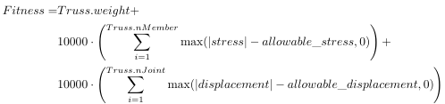
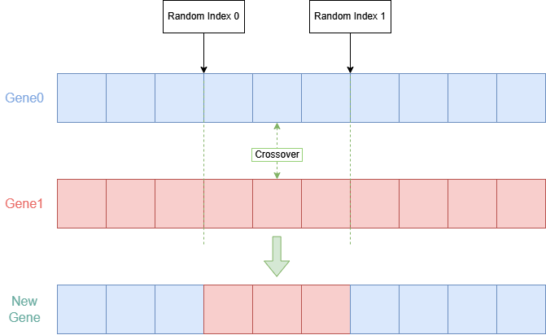
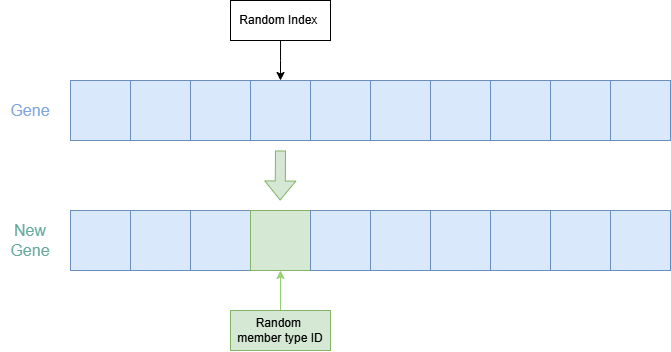
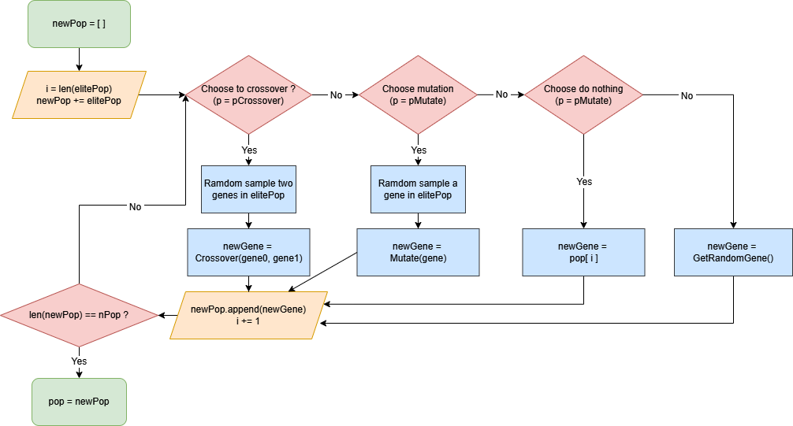

# Truss optimization

## Introduction

After slientruss3d v1.2.x, you could use **`slientruss3d.ga`** module to do `truss type selection optimization` conveniencely with `Genetic Algorithm (GA)`! Just simply define the topology of the truss and what member types you want to use, and then you could start the optimization. 

---

## Gene data structure

A gene in slientruss3d is a list of integers. Each integer is a index of the member type in the member type list input by the user. And the length of a gene is equal to `Truss.nMember`.
Example:

```python
[0, 3, 1, 8, 9, 15, 0, 3]
```

---

## Fitness function

The following is the **`default`** fitness function:



---

## Crossover

The following is the **`default`** crossover policy:



---

## Mutation

The following is the **`default`** mutation policy:



---

## Evolution policy

The following is the **`default`** evolution policy (only for one step):



Where `p` is probability.

---

## Example

The following is the example code of GA:

```python
from slientruss3d.truss import Truss
from slientruss3d.type  import MemberType
from slientruss3d.ga    import GA
import random


def TestGA():
    # Allowable stress and displacement:
    ALLOWABLE_STRESS         = 30000.
    ALLOWABLE_DISPLACEMENT   = 10.

    # Type the member types you want to use here:
    MEMBER_TYPE_LIST = [MemberType(inch, random.uniform(1e7, 3e7), random.uniform(0.1, 1.0)) for inch in range(1, 21)]

    # GA settings:
    MAX_ITERATION      = None  # When [MAX_ITERATION] is None, do infinite iteration until convergence (reach [PATIENCE_ITERATION]).
    PATIENCE_ITERATION = 50

    # Truss object:
    truss = Truss(3)
    truss.LoadFromJSON('./data/bar-120_input_0.json')

    # Do GA:
    ga = GA(truss, MEMBER_TYPE_LIST, ALLOWABLE_STRESS, ALLOWABLE_DISPLACEMENT, nIteration=MAX_ITERATION, nPatience=PATIENCE_ITERATION)
    minGene, (fitness, isInternalAllowed, isDisplaceAllowed), finalPop, bestFitnessHistory = ga.Evolve()

    # Translate optimal gene to member types:
    truss.SetMemberTypes(ga.TranslateGene(minGene))

    # Save result:
    truss.Solve()
    truss.DumpIntoJSON(f'bar-120_ga_0.json')
```

---

## GA object

### Constructor

```python
GA(truss, memberTypeList, allowStress=30000., allowDisplace=10., nIteration=None, nPatience=50, nPop=200, nElite=50, pCrossover=0.7, pMutate=0.1, pOrigin=0.1, isCheckWorst=True) -> None
```

- **`truss`** : Truss object.
- **`memberTypeList`** : A list which contains what member type you want to use as the options to be optimized.
- **`allowStress`** : Allowable stress.
- **`allowDisplace`** : Allowable displacement.
- **`nIteration`** : Maximum number of iterations for updating the population (When it's None, GA will do infinite iteration until convergence ( no more improvement for `nPatience` iterations).)
- **`nPatience`** : Maximun number of iterations for no improvement.
- **`nPop`** : Number of individuals in the population.
- **`nElite`** : Individuals whose fitness value are ranked last `nElite` will be selected as elites for crossover or mutation.
- **`pCrossover`** : Probability to crossover.
- **`pMutate`** : Probability to mutate.
- **`pOrigin`** : Probability to do neither crossover nor mutate.
- **`isCheckWorst`** : Whether to check the two worst cases (assign max `cross-sectional area` (A) and max `cross-sectional area * Young's modulus` (EA) to all members) both do not violate the allowable stress and allowable displacement before executing GA.

<br/>

### Execute generic algorithm

```python
GA.Evolve(isPrintMessage=True) -> tuple[list[int], tuple[int, bool, bool], list[list[int]], list[float]]
```

- **`isPrintMessage`** : Whether to print optimization messages in the screen or not.
- Return: (1., 2. is the same output as [GA.GetBestFeasibleGene](#Get-the-best-and-feasible-gene).)

    >1. `Best and *feasible* gene`
    >2. Tuple(`Fitness corresponding to 1.` , `Is all internal stresses allowed ?` , `Is all displacements allowed ?`)
    >3. `Final population`
    >4. `History of best fitness value at each iteration`

<br/>

### Translate gene to member types

```python
GA.TranslateGene(gene) -> dict[int, MemberType]
```

- **`gene`** : Gene, which is a list of integers.
- Return:

    > A dictionary whose key is `member ID` and value is `MemberType object`.

<br/>

### Set member types of the truss by a gene

```python
GA.SetMemberTypesByGene(gene, truss) -> Truss
```

- **`gene`** : Gene, which is a list of integers.
- **`truss`** : Truss object.

    > This method is equivalent to `truss.SetMemberTypes(ga.TranslateGene(gene))`.
    > The reference of the output truss is the same as the input truss.

<br/>

### Get the best and feasible gene

```python
GA.GetBestFeasibleGene(pop) -> tuple[list[int], tuple[int, bool, bool]
```

- **`pop`** : Population, which is a list of genes.

    > If there is no feasible gene, this method will return the `worst` gene which has the highest fitness in the population.

<br/>

### Return a random gene

``` python
GA.GetRandomGene() -> list[int]
```

---

## Customization

As long as you comply with the function signiture and the meaning of every input, output varible, it's possible to customize your own generic algorithm by **`inheriting`** class GA in slientruss3d. The following are the methods you could perhaps override them to make your own custom GA.

```python
class CustomGA(GA):

    ...

    def GetFitness(self, gene: list[int]) -> tuple[float, bool, bool]:
        ## ...... something to do ...... ##
        return fitness, isInternalAllowed, isDisplaceAllowed
    
    def Initialize(self) -> list[list[int]]:
        ## ...... something to do ...... ##
        return pop
    
    def Select(self, pop: list[list[int]]) -> tuple[list[list[int]], float]:
        ## ...... something to do ...... ##
        return elitePop, bestFitness
    
    def Crossover(self, gene0: list[int], gene1: list[int]) -> list[int]:
        ## ...... something to do ...... ##
        return newGene
    
    def Mutate(self, gene: list[int]) -> list[int]:
        ## ...... something to do ...... ##
        return newGene
    
    def UpdatePop(self, pop: list[list[int]], elitePop: list[list[int]]) -> list[list[int]]:
        ## ...... something to do ...... ##
        return newPop
    
    ...

```

Here is an example:

```python
from slientruss3d.ga import GA

class CustomGA(GA):
    def GetFitness(self, gene):
        truss = self.SetMemberTypesByGene(gene, self.truss)
        truss.Solve()

        isInternalAllowed, internalViolation = truss.IsInternalStressAllowed(self.allowStress, True)
        isDisplaceAllowed, displaceViolation = truss.IsDisplacementAllowed(self.allowDisplace, True)

        fitness = truss.weight
        if not isInternalAllowed: fitness += internalViolation / self.allowStress   * 1e3
        if not isDisplaceAllowed: fitness += displaceViolation / self.allowDisplace * 1e3
        return fitness, isInternalAllowed, isDisplaceAllowed
```

This example shows that if you don't want to use default fitness function, you can customize it by overriding the origin method `GetFitness`. The new fitness function just `adjusts the penalty weights` for the sum of exceeding quantities of stresses and displacements (1e5 -> 1e3).  
